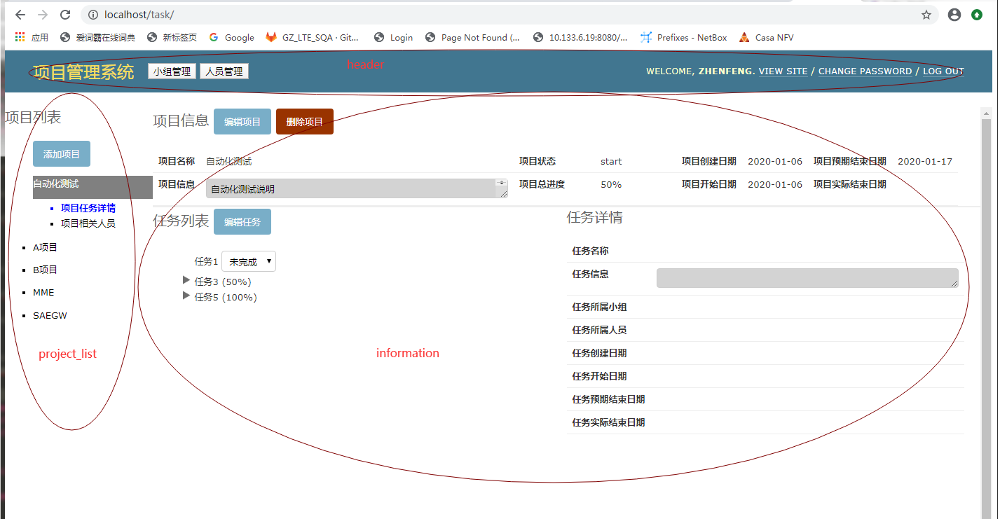

##  

###### 克隆仓库
- 命令`git clone https://172.25.2.42/gz_lte_sqa/task_mn_system.git` 
	- 克隆过程中需要输入个人gitlab账号密码
	- ps:如果提示`fatal: unable to access 'https://vcs.in.ww-it.cn/ecox/ecox.git/': SSL certificate problem: unable to get local issuer certificate` 
		请使用命令`git config --global http.sslVerify false`

--------
###### 目录结构说明
``` bash
.
├── css        # 层叠样式表
├── js         # js库
├── images     # 网页图片
├── design_doc # 设计文档
└── pics       # 设计文档中图片

```
 
# 项目说明
这是一个web《项目管理系统》，包含以下功能：
- 查看，创建，修改，删除项目
- 每个项目下可以查看，创建，修改，删除任务，任务之间有层次关系，最多3层
- 查看，创建，修改，删除小组
- 查看，创建，修改，删除人员
- 人员可以绑定到一个或多个小组
- 任务可以分配给小组以及人员，人员可以修改任务状态（未完成/完成）



# 环境说明
- Apache: 运行php文件需要
- mysql: 数据库

需要4个表：
## 1. 项目表
```
id	name	    notes	        create_time	 start_time	 est_com_time	act_com_time	pc	status	longtime
1	自动化测试	自动化测试说明	2020-01-06	 2020-01-06	 2020-01-17			                start	no
2	A项目	    达到	        2020-01-07	 2020-01-01	 2020-01-25			                start   no
```
## 2. 任务表
```
id	name	notes	parent_id	project_id	group_id	staff_id	create_time	start_time	est_com_time	act_com_time	pc	status
1	任务1	说明		1	         3	                    9	    2020-01-06	2020-01-06	2020-01-17		0	                 start
3	任务3	费大幅度                 1			                    2020-01-06	2020-01-07	2020-01-17		50	finish
```
## 3. 小组表
```
id	name
2	测试组
3	自动化

```
## 4. 人员表
```
id	name	group_id
9	马镇峰	3,6
10	肖金水	3
```

- PHP: 运行php文件需要
- 推荐使用集成环境Wampserver

# 文件说明
## 数据库配置文件
db_config.php
```
return array(
'host'=>'172.0.10.81',
'user'=>'root',
'passwd'=>'casa',
'port'=>'3306',
'db'=>'testlink',          （数据库）
'project'=>'pmj_project',  (项目表名)
'task'=>'pmj_task',        (任务表名)
'groups'=>'pmj_groups',    (小组表名)
'personnel'=>'pmj_personnel',  (人员表名)
)
```

## JS_lib.js
自制JS库

## db_base.php, task_manage_system.php
自制mysql库

## index.html
主界面

